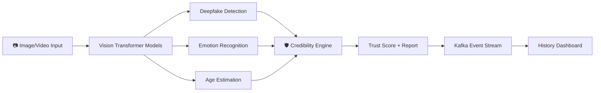

# 🔍 TruthLens AI — Pitch Deck

---

## 🎯 The Problem

> **"By 2026, 90% of online content could be synthetically generated."**
> — World Economic Forum

Deepfakes are everywhere. From manipulated political videos to AI-generated scam calls, the line between *real* and *fake* is vanishing. Existing tools are fragmented — they detect one thing but miss the bigger picture. There's no **unified trust verification platform** that analyzes images, video, emotions, and identity in real-time.

### The Cost of Inaction
- 💰 **$40B+** in fraud losses attributed to synthetic media (2025)
- 🗳️ Election misinformation campaigns using deepfake videos
- 🏦 Identity fraud through face-swapped KYC verification
- 👶 Child safety risks from age-spoofed profiles

---

## 💡 The Solution — TruthLens AI

**TruthLens AI** is an **all-in-one AI-powered trust verification platform** that goes far beyond simple deepfake detection.

### Six Integrated Modules, One Platform

| Module | What It Does | Why It Matters |
|--------|-------------|----------------|
| 🔍 **Deepfake Detector** | Classifies images as real or AI-generated using Vision Transformers | Core authenticity verification |
| 🕐 **History Scan** | Tracks behavioral patterns, flags anomalies, generates credibility scores | Transparent audit trail for compliance |
| 🎙️ **Page Voice Call** | Voice-driven AI assistant using Web Speech API | Hands-free truth analysis on any page |
| 😊 **Emotion Detector** | 7-class micro-expression recognition + deception cue analysis | Identifies stress, anxiety, and lying patterns |
| 👤 **Age Estimation** | Deep CV age classification from facial inputs | Age-gating, compliance, and identity verification |
| 📹 **Video Call Analysis** | Real-time combined analysis during live video | Trust overlays for video-first workflows |

### Plus Enterprise Features
- 📊 **Kaggle Dataset Integration** — benchmark accuracy against real-world datasets
- ⚡ **Apache Kafka Streaming** — event-driven architecture for scale
- 🛡️ **Credibility Scoring** — composite trust score from all signals

---

## 🏗️ How It Works

1. **User uploads** an image, enables webcam, or joins a video call
2. **Three AI models run simultaneously** — deepfake, emotion, and age
3. **Credibility Engine** fuses all signals into a single trust score
4. **Results stream** to Kafka for real-time monitoring and audit logs
5. **Voice assistant** provides spoken analysis on demand

---

## 🎯 Target Market

### Primary
- **FinTech & Banking** — KYC verification, fraud prevention, liveness detection
- **Social Media Platforms** — content moderation, fake account detection
- **HR & Remote Hiring** — video interview integrity verification

### Secondary
- **Law Enforcement** — digital forensics, evidence authentication
- **Education** — online exam proctoring, academic integrity
- **Media & Journalism** — source verification before publishing

### Market Size
- 🌍 **Deepfake Detection Market**: $1.7B (2025) → **$15.8B (2030)** — CAGR 55%
- 🌍 **Identity Verification Market**: $12.8B (2025) → **$28.8B (2030)**

---

## 🏆 Competitive Advantage

| Feature | TruthLens AI | Competitor A | Competitor B |
|---------|:---:|:---:|:---:|
| Deepfake Detection | ✅ | ✅ | ✅ |
| Emotion Analysis | ✅ | ❌ | ❌ |
| Age Estimation | ✅ | ❌ | ⚠️ |
| Live Video Analysis | ✅ | ❌ | ❌ |
| Voice Assistant | ✅ | ❌ | ❌ |
| Credibility Scoring | ✅ | ❌ | ❌ |
| Behavioral Patterns | ✅ | ❌ | ❌ |
| Event Streaming (Kafka) | ✅ | ❌ | ❌ |
| Open-Source Models | ✅ | ❌ | ✅ |

> **Our moat**: No one else combines deepfake detection + emotion analysis + age verification + behavioral analytics into a **single, real-time platform** with enterprise-grade event streaming.

---

## 🛠️ Tech Stack

| Layer | Technology |
|-------|-----------|
| **AI Models** | HuggingFace Transformers, Vision Transformers (ViT) |
| **Backend** | Python, Flask, REST APIs |
| **Streaming** | Apache Kafka (with JSON fallback) |
| **Datasets** | Kaggle API integration |
| **Frontend** | Modern glassmorphism UI, Web Speech API |
| **Voice** | Browser-native Speech Recognition + Synthesis |
| **Deployment** | Docker, Gunicorn, scalable microservices |

---

## 📈 Business Model

### SaaS Tiers

| Tier | Price | Features |
|------|-------|----------|
| **Free** | $0/mo | 50 scans/month, deepfake detection only |
| **Pro** | $49/mo | Unlimited scans, all 6 modules, API access |
| **Enterprise** | Custom | Kafka streaming, custom models, SLA, on-prem deployment |

### Revenue Streams
1. 💳 **Subscription SaaS** — monthly/annual plans
2. 🔌 **API Licensing** — per-call pricing for developers
3. 🏢 **Enterprise Contracts** — custom deployments for banks, platforms
4. 📊 **Data Insights** — anonymized trend reports for industry

---

## 🗺️ Roadmap

### ✅ Phase 1 — MVP (Current)
- Deepfake detection with ViT model
- Emotion detector (7-class + deception cues)
- Age estimation with minor detection
- Live video call analysis  
- Voice assistant (Web Speech API)
- History scan with credibility scoring
- Kafka event streaming
- Kaggle dataset benchmarking

### 🔮 Phase 2 — Q3 2026
- Audio deepfake detection (voice cloning)
- Multi-face tracking in video
- Mobile app (React Native)
- REST API with developer portal

### 🚀 Phase 3 — Q1 2027
- Real-time browser extension
- Zoom/Teams/Meet plugin integration
- On-premise enterprise deployment
- Custom model fine-tuning pipeline

---

## 👥 Team

| Role | Name |
|------|------|
| **Founder & Lead Developer** | Kartik Singh |
| | Full-stack AI engineer with expertise in computer vision, deep learning, and web applications |

---

## 💬 The Ask

> We're seeking **early adopters and collaborators** to validate TruthLens AI across FinTech, social media, and enterprise use cases.

### What We Need
- 🤝 **Pilot partners** — organizations to test in real workflows
- 💡 **Feedback** — from users, investors, and industry experts
- 🌱 **Seed funding** — to scale infrastructure and expand the team

---

## 🎤 One-Liner

> **"TruthLens AI is the world's first unified trust verification platform — combining deepfake detection, emotion analysis, age estimation, and behavioral intelligence into one real-time system."**

---

*Built with ♥ by Kartik Singh*  
*Powered by HuggingFace, Apache Kafka, and Vision Transformers*
